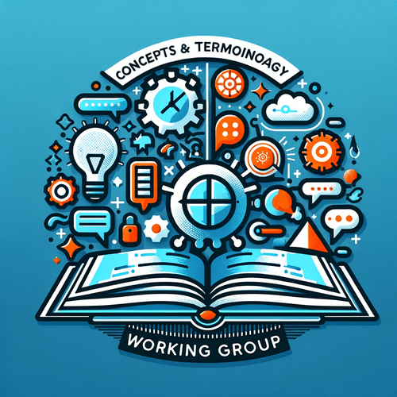

# Concepts and Terminology Working Group

Image created using ChatGPT4/DALL·E

##### Prompt

> create an image for Concepts and Terminology Working Group

#### Output

*Here's the logo for the Concepts and Terminology Working Group, designed to highlight the importance of language, communication, and understanding in technology and research. It combines traditional and digital symbols to reflect the integration of knowledge across fields.*
