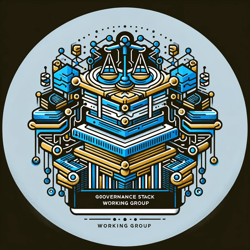

# Governance Stack Working Group

Image created using ChatGPT4/DALL·E

##### Prompt

> create an image for Governance Stack Working Group

#### Output

*Here's the logo for the Governance Stack Working Group, symbolizing the integration of governance, policy-making, and technology in digital spaces. The design reflects the group's mission to develop comprehensive governance frameworks with a color scheme that emphasizes trust, value, and neutrality.*
