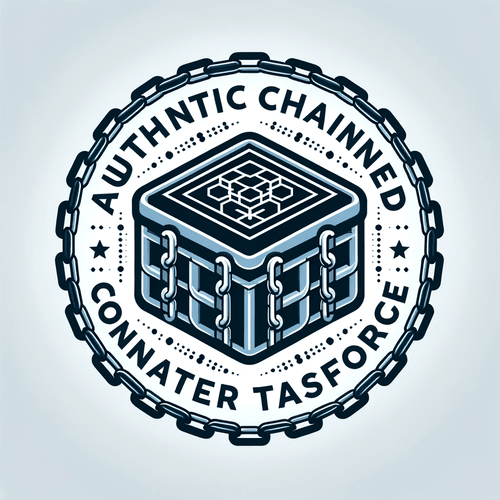

# Authentic Chained Data Container Task Force

Image created using ChatGPT4/DALL·E

##### Prompt

> create an image for Authentic Chained Data Container Task Force

#### Output

*Here's the logo for the Authentic Chained Data Container Task Force, designed to embody blockchain technology, data integrity, and security through the imagery of a stylized container interlocked with chains. The color scheme aims to evoke trust, reliability, and sophistication.*
