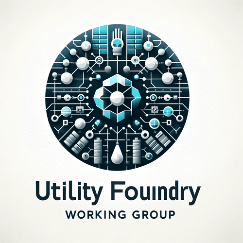

# Utility Foundry Working Group

Image created using ChatGPT4/DALL·E

##### Prompt

> create an image for Utility Foundry Working Group

#### Output

*Here's the logo for the Utility Foundry Working Group, designed to represent the strength, reliability, and innovation of foundational digital infrastructure. The imagery and industrial color scheme reflect the group's focus on building and enhancing digital utility frameworks.*
